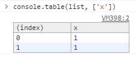

Console
====

Console 是浏览器开发工具或 JavaScript 执行环境提供的工具，可以使用 JavaScript 向 Console 中输出（打印）文本等信息，用来辅助调试。

参考：[MDN: Console](https://developer.mozilla.org/en-US/docs/Web/API/Console)
[DevToolsWG: console-object](https://github.com/DeveloperToolsWG/console-object/blob/master/api.md)
[Google Dev: Using the Console](https://developers.google.com/web/tools/chrome-devtools/debug/console/?hl=en)

console 是全局对象，可以在任意位置调用它：

```js
console.log('Hello Console.');
```

方法
----

### assert()

如果表达式判断为 false，则向输出信息。

语法：
>console.assert(expression, object);

参数：

+ expression 用于判断的表达式
+ object 输出到控制台的内容

### clear()

清空控制台的信息。

### count()

输出文本信息及次数，并对同样的信息累加次数。

语法：
>console.count(label);

次数：

+ label 要输出的文本内容

只要输出的内容曾经出现过，就累加次数：

```js
console.count('abc'); // abc: 1
console.count('abc123'); // abc123: 1
console.count('abc'); // abc: 2
```

### debug()

和 console.log() 相同。

### dir()

输出 JavaScript 对象，如果对象为 DOM 元素，则输出其代表的 DOM 元素。

语法：
>console.dir(document.body);

### dirxml()

输出元素的 XML 对象。对于 HTML 元素，作用和 console.log() 相同。

语法：
>var element = document.getElementById('target');  
>console.dirxml(element);

### error()

和 console.log() 类似，不过会附加堆栈信息，并以错误的样式（一般是红色文字）呈现。

语法：
>console.error(object [, object, …]);

### exception()

和 console.error() 类似。

### group()

开始一个新的组，其后的信息将会在同一组中呈现，知道该组被关闭（console.groupEnd()）。

语法：
>console.group(object[, object, …]);

```js
console.group('Group 1:');
console.log('Item 1 of Group');
console.groupEnd();
```

组和组可以相互嵌套。

### groupCollapsed()

与 console.group() 类似，不过默认该组处于折叠状态。

### groupEnd()

关闭通过 console.group() 或 console.groupCollapsed() 打开的组。

### info()

和 console.log() 类似。

### log()

向控制台输出内容，内容可以为任何 JS 值、对象、函数或类。

语法：
>console.log('abc');  
>console.log('1 + 2 =', 1 + 2);  
>console.log(document.body);  
>console.log({ x:１, y: 2 });  
>console.log([2, 3, 4]);

也可以类似 C 中的 printf() 方法，通过 %* 的方式提供参数并执行 [数据格式化](https://developers.google.com/web/tools/chrome-devtools/debug/console/console-write#string-substitution-and-formatting)。

### profile()

启动捕获浏览器的 CPU 曲线，可以提供一个特定的名称（label）来区分不同的捕获。可以在捕获过程结束后执行停止操作（console.profileEnd()）。

语法：
>console.profile([label]);

```js
console.profile('Monitor CPU Usage');
// do something
console.profileEnd();
```

可以在浏览器开发工具的 Profiles 页面查看捕获的结果。

### profileEnd()

停止通过 console.profile() 启动的捕获动作。

### table()

使用表格的形式输出数组或对象。

语法：
>console.table(data[, columns]);

参数：
>columns 指定对象的哪些属性会被呈现出来。

```js
var list = [{
  x: 1,
  y: 2
}, {
  x: 3,
  y: 4
}];

console.table(list, ['x']);
```



### time()

通过指定的 label 启动一个计时器，可以通过 console.timeEnd(label) 停止该计时器。

```js
console.time('Timer001');
// do something
console.timeEnd('Timer001');
// => Timer001: 123ms
```

### timeEnd()

停止 label 指定的定时器，并将 label 和时长输出到控制台。

### timeStamp()

标记一个特定的时间点，可以通过浏览器开发工具的 Timeline 界面查看。

语法：
>console.timeStamp([label]);

### trace()

输出制定对象在该位置的堆栈信息。

语法：
>console.trace(object);

### warn()

类似于 console.log()，不过信息以警告的形式呈现。
