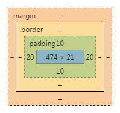

盒模型（box-model）
====

在页面中，所有元素都代表了一个矩形区域（box），浏览器通过计算这个矩形区域的尺寸来完成布局等动作。



box 中包含了一个元素的下列部分：

+ 内容区域（content-width/content-height）
+ 内边距（padding）
+ 边框（border）
+ 外边距（margin）

矩形尺寸计算（box-sizing）
----

CSS 的 `box-sizing` 属性指定了 box 的宽度和高度如何计算：

1.content-box

使用内容区域的宽度和高度：

```
width = content-width
height = content-height
```

2.border-box

包含边框、内边距和内容区域的总宽度和总高度：

```
width = border-left
  + padding-left
  + content-width
  + padding-right
  + border-right

height = border-top
  + padding-top
  + content-height
  + padding-bottom
  + border-bottom
```

参考：[box-model](http://zh.learnlayout.com/box-model.html)
