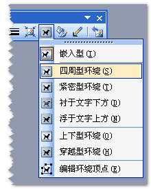

浮动（floating）
====

float
----

设置元素是否浮动。

`float` 最早被设计为用来进行图文混排的，即使文本环绕图片的排版方式。目前往往应用于不同类型的布局（类似表格的横向布局，多列布局等）。

 图片来自 [张鑫旭](http://www.zhangxinxu.com/wordpress/2010/01/css-float%E6%B5%AE%E5%8A%A8%E7%9A%84%E6%B7%B1%E5%85%A5%E7%A0%94%E7%A9%B6%E3%80%81%E8%AF%A6%E8%A7%A3%E5%8F%8A%E6%8B%93%E5%B1%95%E4%B8%80/)

浮动的元素会脱离正常的文档流，宽度尽量收窄，并向左或向右移动，直到碰到父元素左右边缘或者其他浮动元素的边缘停止。

浮动的元素不在占据父元素的空间，所以父元素高度的计算不会包含已经浮动的元素。当浮动的元素高度超出父元素时，会溢出父元素（父元素塌陷），可以使用多种方式来闭合浮动或清除浮动。

属性值：

1. none 不浮动（默认）
2. left 向左浮动
3. right 向右浮动

clear
----

设置清除是否浮动。

属性值：

1. none 不清除浮动（默认）
2. left 清除左侧浮动
3. right 清除右侧浮动
4. both 清除两侧的浮动

闭合浮动和清除浮动
----

参考：<http://www.iyunlu.com/view/css-xhtml/55.html>
