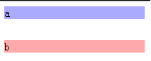
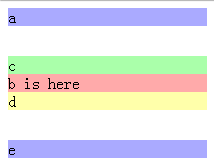

外边距(margin)
====

参考：<http://codepen.io/anon/pen/zvJypb>

margin-top
----

设置顶部外边距。

属性值：

1. auto 自动
2. 尺寸值
3. 百分值（根据父元素的宽度计算）

margin-right
----

设置右侧外边距。

margin-bottom
----

设置底部外边距。

margin-left
----

设置左侧外边距。

margin
----

在同一个声明中设置内边距属性。

可包括的属性：

+ margin-top
+ margin-right
+ margin-bottom
+ margin-left

有四种设置方式：

1. a b c d 分别设置顶部、右侧、底部和左侧的外边距
2. a b c 分别设置顶部、左右和底部的外边距
3. a b 分别设置顶部和底部、左右的外边距
4. a 一次设置四个外边距

外边距合并
----

上下相邻的两个元素或嵌套的父元素和第一个子元素（或最后一个子元素） a b，a 的 margin-bottom 会和 b 的 margin-top 合并，最终的大小为两个值中较大的那个。

### 相邻元素的外边距合并

```html
<div class="a">a</div>
<div class="b">b</div>
```

```css
.a {
  background-color: #AAF;
  margin-bottom: 10px;
}
.b {
  background-color: #FAA;
  margin-top: 30px;
}
```


<http://codepen.io/anon/pen/avaMdL>

### 嵌套元素的外边距合并

```html
<div class="a">a</div>
<div class="b">
  <div class="c">c</div>
  <div>b is here</div>
  <div class="d">d</div>
</div>
<div class="e">e</div>
```

```css
.a,
.e{
  background-color: #AAF;
}
.b {
  background-color: #FAA;
  margin-top: 10px;
  margin-bottom: 30px;
}
.c {
  background-color: #AFA;
  margin-top: 30px;
}
.d {
  background-color: #FFA;
  margin-bottom: 10px;
}
```


<http://codepen.io/anon/pen/Maqxyj>

参考：[w3help](http://www.w3help.org/zh-cn/kb/006/#header_3)
