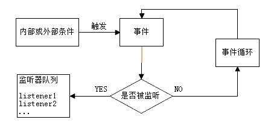
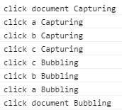

事件（Event）
====

事件在程序中用来监视可能产生的动作，并在该动作发生时产生相应的反应（调用回调函数）。GUI 程序中的用户操作都是由事件驱动的，如界面中的按钮，会在鼠标点击时执行相应的动作。

事件机制
----

JavaScript 引擎使用 [事件循环](http://www.ruanyifeng.com/blog/2014/10/event-loop.html) （Event Loop）的机制来处理事件监听函数。

参考：[MDN: EventLoop](https://developer.mozilla.org/zh-CN/docs/Web/JavaScript/EventLoop)

+ 事件是浏览器（或 JavaScript 引擎）内部机制触发的（如页面加载完成 onload），或者是用户触发的（如键盘输入、鼠标点击，或者触摸屏的触摸操作）；
+ 事件是浏览器（或 JavaScript 引擎）的内部机制，在特定条件下发生（如用户点击了键盘），而且在特定条件下一定会被触发；
+ 我们可以通过代码主动触发事件；
+ 如果该事件正在被监听（注册过回调函数），则执行监听函数；否则，事件继续传播，不产生任何影响；
+ 事件监听函数一旦注册成功，都会在事件发生时执行。除非该函数解除对事件的监听。



DOM 中事件的触发和传播，分为三个阶段：

+ 捕获阶段。事件从 document 开始被触发，逐层向目标元素传播；
+ 触发阶段。事件传播到目标元素；
+ 冒泡阶段。事件从目标元素开始向上传播，逐层冒泡至 document。

```html
<div id="a">aaa
  <div id="b">bbb
    <div id="c">ccc</div>
  </div>
</div>
```

```js
var a = document.getElementById('a');
var b = document.getElementById('b');
var c = document.getElementById('c');

document.addEventListener('click', function(e) {
  console.log(e.type, 'document', 'Capturing');
}, true);
document.addEventListener('click', function(e) {
  console.log(e.type, 'document', 'Bubbling');
}, false);

a.addEventListener('click', function(e) {
  console.log(e.type, 'a', 'Capturing');
}, true);
a.addEventListener('click', function(e) {
  console.log(e.type, 'a', 'Bubbling');
}, false);

b.addEventListener('click', function(e) {
  console.log(e.type, 'b', 'Capturing');
}, true);
b.addEventListener('click', function(e) {
  console.log(e.type, 'b', 'Bubbling');
}, false);

c.addEventListener('click', function(e) {
  console.log(e.type, 'c', 'Capturing');
}, true);
c.addEventListener('click', function(e) {
  console.log(e.type, 'c', 'Bubbling');
}, false);
```

当我们点击 div#c 的时候，浏览器控制台会打印出如下的内容：



参考：<http://codepen.io/anon/pen/epQKYP>

绑定和解除绑定事件监听函数
----

绑定事件监听函数（后面简称为 监听事件）有三种方式：

1\. 在 HTML 属性中绑定监听函数：

```html
<p onclick="listener()">click me</p>
```

不推荐这种方式，会让代码逻辑混乱。

2\. 通过 on[event] 属性绑定监听函数：

```js
var target = document.getElementById('target');

target.onclick = function(e) {
  // listener
};
```

也不推荐这种方式，因为只能绑定一个监听函数，重复绑定会覆盖掉之前的监听函数。

3\. 使用 target.addEventListener() 方式绑定监听函数：

```js
var target = document.getElementById('target');

target.addEventListener('click', function(e) {
  // listener
});
```

推荐使用这种方式，可以绑定多个监听函数，也可以分别解除绑定。多个监听函数按照绑定的顺序依次执行（捕获阶段先执行，冒泡阶段后执行）。

解除事件监听函数的绑定，有两种方式，分别对应上面的 2 和 3 两种绑定方式：

1\.

```js
target.onclick = null;
```

2\.

```js
var listener = function(e) {
  // listener
};

// target.addEventListener('click', listener);

target.removeEventListener('click', listener);
```

第二种方式的 listener 参数必须是 addEventListener 绑定的同一个监听函数。

阻止默认行为
----

某些时候，我们需要阻止浏览器处理事件的默认行为（如阻止链接跳转，或表单提交），可以通过 event.preventDefault() 来实现：

```html
<a href="https://www.baidu.com/" target="_blank" id="link">拒绝百度</a>
```

```js
var link = document.getElementById('link');

link.addEventListener('click', function(e) {
  e.preventDefault(); // 然后链接打不开了
});
```

在该事件的任何监听函数中调用 event.preventDefault()，都会阻止该事件的默认行为。

阻止冒泡
----

事件冒泡是一个有趣的机制，它让我们可以在父元素中监听子元素以及父元素本身发生的事件（参考：事件委托）。但有时候我们需要严格区分事件发生在当前元素，还是子元素。这时候可以阻止事件冒泡（向上传播）：

```html
<div id="a">
  <div id="b"></b>
</div>
```

```js
var a = document.getElementById('a');
var b = document.getElementById('b');

a.addEventListener('click', function(e) {
  // click on a, not from b
});
b.addEventListener('click', function(e) {
  // click on b, not bubble to a
  e.stopPropagation();
});
```

event.stopImmediatePropagation() 也会阻止事件冒泡，而且会阻止其它监听函数的执行。

EventTarget 接口
----

参考：[EventTarget](./event-target.md)

事件委托
----

事件监听函数只能绑定在已经存在的 DOM 元素上，但实际开发中，DOM 结构会经常发生变化，元素也经常被添加、移动和删除。如果每次在元素发生变化时重新绑定监听函数，会让逻辑变得复杂，产生无法预料的问题。

我们可以利用事件冒泡机制，在不会变化的父元素上添加监听函数，并通过判断事件源（event.target）来决定是否执行。这种方式与上面方法的作用相同，而且简单可靠，我们称之为事件委托。

```html
<ul id="list">
  <li>list</li>
  <li>will</li>
  <li>change</li>
  <li>sometimes.</li>
</ul>
```

```js
var list = document.getElementById('list');

list.addEventListener('click', function(e) {
  if(e.target.nodeName === 'LI') {
    // click on li
  }
});
```

事件类型
----

### DOM 事件

### 鼠标事件

### 触摸事件

事件列表
----

参考：[MDN: Events](https://developer.mozilla.org/en-US/docs/Web/Events)

Event 对象
----

参考：[Event](./event.md)
