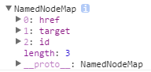
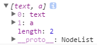
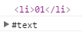
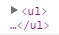

Node 对象
====

参考：[MDN: node](https://developer.mozilla.org/en-US/docs/Web/API/Node)

`Node` 对象代表了 DOM 中的节点，也是所有 DOM 元素的父类。

属性
----

### attributes

返回包含节点所有属性节点的列表（NamedNodeMap，该列表是动态更新的）。

```html
<a href="https://www.google.com/" target="_blank" id="link">Google</a>
```

```js
var link = document.getElementById('link');
link.attributes;
```



### childNodes

返回节点中包含所有元素子节点和文本子节点的列表（NodeList，该列表是动态更新的）。

```html
<p id="p">A link to <a href="https://www.google.com/" target="_blank">Google</a></p>
```

```js
var p = document.getElementById('p');
p.childNodes;
```



### firstChild

返回节点的首个子节点，如果不存在该节点，则返回 null。

```html
<ul id="ul1"><li>01</li><li>02</li><li>03</li></ul>
<ul id="ul2">
  <li>01</li>
  <li>02</li>
  <li>03</li>
</ul>
```

```js
var ul1 = document.getElementById('ul1');
var ul2 = document.getElementById('ul2');
ul1.firstChild;
ul2.firstChild;
```



ul#ul1 的首个子节点为 li{01}，但 ul#ul2 的首个子节点为文本节点，因为在首个 li 元素前，还有一个换行符和两个空格。

### lastChild

返回节点的最后一个子节点。

### nextSibling

返回相邻的下一个兄弟节点，如果不存在该节点，则返回 null。

### nodeName

节点名称。

节点名称的规则：

+ 元素节点以大写的标签名（Element.tagName）作为节点名称
+ 属性节点以属性名（Attr.name）作为节点名称
+ 文本节点以 #text 作为节点名称
+ 文档节点以 #document 作为节点名称
+ 注释节点以 #comment 作为节点名称

### nodeType

节点类型。

节点类型列表：

+ 1 元素节点
+ 2 属性节点
+ 3 文本节点
+ 8 注释节点
+ 9 文档节点

### nodeValue

节点的值。

节点值的规则：

+ 文本节点的值为节点包含的文本
+ 属性节点的值为属性值
+ 注释节点的值为注释的内容
+ 文档节点和元素节点没有 nodeValue 属性（undefined）

### ownerDocument

返回创建当前节点的 document 对象。

### parentNode

返回当前节点的父节点。

```html
<ul>
  <li id="li">01</li>
  <li>02</li>
  <li>03</li>
</ul>
```

```js
var li = document.getElementById('li');
li.parentNode;
```



### parentElement

返回当前节点的父元素节点，如果没有父元素，或者父节点不是元素，则返回 null。

### previousSibling

返回相邻的上一个兄弟节点，如果不存在该节点，则返回 null。

### textContent

返回包含在节点中的文本（包括子节点中的文本）。

参考：[MDN: Node.textContent](https://developer.mozilla.org/zh-CN/docs/Web/API/Node/textContent)

方法
----

继承自 [EventTarget](./event/event-target.md) 接口的方法。

### appendChild()

插入子节点。

语法：
>node.addendChild(childNode);

返回值：
>child 新插入的子节点

### cloneNode()

复制节点。

语法：
>node.cloneNode(cloneChild);

参数：
>cloneChild 是否克隆子节点

返回值：
>clone node 节点的副本

### compareDocumentPosition()

比较两个节点的位置关系。

语法：
>node.compareDocumentPosition(targetNode);

返回值：
>1.DOCUMENT_POSITION_DISCONNECTED/1 两个节点不相关  
>2.DOCUMENT_POSITION_PRECEDING/2 目标节点在当前节点之前  
>3.DOCUMENT_POSITION_FOLLOWING/4 目标节点在当前节点之后  
>4.DOCUMENT_POSITION_CONTAINS/8 目标节点包含在当前节点中  
>5.DOCUMENT_POSITION_CONTAINED_BY/16 当前节点包含在目标节点中  
>6.DOCUMENT_POSITION_IMPLEMENTATION_SPECIFIC/32 两个节点的关系无法比较

### contains()

检查当前节点是否包含目标节点（目标节点是否为当前节点的子节点）。

语法：
>node.contains(targetNode)

返回值：
>boolean true 包含；false 不包含

### hasChildNodes()

检测节点是否包含子节点。

语法：
>node.hasChildNodes();

返回值：
>1.true 包含至少一个子节点  
>2.false 不包含任何子节点

### insertBefore()

将目标节点作为当前节点的子节点，并插入到指定节点之前。

语法：
>node.insertBefore(newNode, targetBefore);

参数：
>1.newNode 要插入的新节点  
>2.targetBefore 插入目标位置的节点

返回值：
>child 插入的新节点

### isEqualNode()

检测两个节点是否同类型并同名。

语法：
>node.isEqualNode(anotherNode);

检测的属性包括：

+ nodeType
+ nodeName
+ localName
+ namespaceURI

返回值：
>1.true 两个节点相同  
>2.false 两个节点不同

### normalize()

将当前节点及其子节点规范化：

+ 去掉所有空节点（仅由空格、换行符等组成的文本节点）；
+ 合并相邻的文本节点（可能由 DOM 操作或内容操作产生）。

### removeChild()

删除指定的子节点。

语法：
>node.removeChild(childNode);

返回值：
>child 被删除的节点

### replaceChild()

替换指定的子节点。

语法：
>node.replaceChild(newChild, oldChild);

返回值：
>old 被替换的节点
