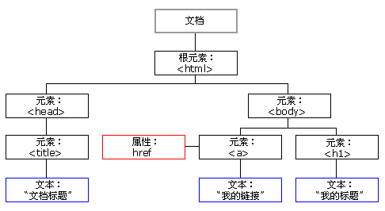

DOM 文档对象模型
====

`DOM` （Document Object Model，文档对象模型）提供了通过 `JavaScript` 访问和控制 HTML 和 XML（包括 SVG） 文档内容的接口。

`DOM` 的核心是将文档中的所有内容作为对象处理，这些对象又被称作节点（Node）。

节点
----

`DOM` 中的节点包括：

+ 代表每个 HTML 元素的 __元素节点__
+ 代表整个 HTML 文档（HTML 元素）的 __文档节点（document 对象）__
+ 代表 HTML 元素属性的 __属性节点__
+ 代表嵌套在 HTML 元素中的文本的 __文本节点__
+ 代表注释的 __注释节点__

参考：[node](./node.md)

节点树（DOM 树/文档树）
----

HTML 文档在浏览器中被解析成树形数据结构，该数据结构称为节点树（DOM 树/文档树）。



节点树的特征：

+ document 节点称为 __根节点（root node）__
+ 除了文档节点，所有节点都有 __父节点__ 和 __祖先节点__
+ 大部分元素都有 __子节点__
+ 父节点相同的节点称为 __兄弟节点__

访问节点
----

### 查找节点

document 对象提供了从文档中查找元素/集合的方法：

+ getElementById("id")
+ getElementByName("name")
+ getElementsByClassName("class")
+ getElementsByTagName("tag")
+ querySelector("selectors")
+ querySelectorAll("selectors")

也可以直接通过 document 对象的属性访问某些元素/集合：

+ document.all
+ document.images
+ document.links
+ document.body
+ ...

参考：[document](./document.md) 和 [selector-apis](./selector-apis.md)

注：本文中的 `元素` 一词等同于 `节点` 。

### 读取/设置 HTML 属性

+ node.attributes nodeList 属性列表 node.attributes[0].nodeName（属性名）/.nodeValue（属性值）
+ elmt.classList 数组 ["class0","class1",...]
+ elmt.name str name 属性值
+ elmt.className str class 属性值
+ elmt.getAttribute("attr")  str attr 属性值
+ elmt.setAttribute("attr","value")
+ elmt.hasAttribute("attr") true/false
+ elmt.hasAttributes()  true/false
+ elmt.removeAttribute("attr")
+ elmt.setAttributeNode("attr","value")

参考：[node](./node.md) 和 [element](./element.md)

### 读取/修改 HTML 内容

+ elmt.innerHTML
+ elmt.ouerHTML
+ textNode.nodeValue

访问节点树
----

### 遍历节点树

节点/集合的访问方式只能访问到元素节点，如果需要访问属性节点和文本节点，还需要借助节点之间的关系：

+ node.childNodes 子节点列表
+ node.firstChild 首个子节点
+ node.lastChild 最后一个子节点
+ node.nextSibling 下一个兄弟节点
+ node.previousSibling  上一个兄弟节点
+ node.parentNode 父节点
+ node.textContent 所有文本，包含特殊字符（换行等）
+ node.hasChildNodes() true/false

### 添加/复制/删除节点

+ node.appendChild(child)
+ node.cloneNode(child)
+ node.insertBefore(newNode,target)
+ node.removeChild(child)
+ node.replaceChild(child)

访问节点样式
----

### node.style

node.style 属性代表了节点的 CSS 样式，可通过它来访问/操作节点的样式：

```js
var target = document.getElementById("target");
target.style.backgroundColor = "#CCC";
```

在 style 属性中的任何包含 `-` 的样式属性名都要采用 `驼峰命名法` ，如：

```
margin-top --> marginTop
background-color --> backgroundColor
```

另外，任何 style 中样式的值均为字符串类型，其格式与 CSS 中的属性值相同。

参考：[MDN: HTMLElelemt.style](https://developer.mozilla.org/en-US/docs/Web/API/HTMLElement/style) 和 [CSSOM](../cssom/readme.md)

### 优化方案

如果需要修改大量节点的样式，或者需要修改大量样式，建议先在 CSS 中编写好样式，然后通过 JS 修改节点的 class/id 等属性值，使其应用相应的样式：

```css
.blue{
  color:#00F;
}
```

```js
document.getElementsByClassName("target").className += " blue";
```

API
----

### Drag & Drop

事件
----

参考：[event](./event/readme.md)
