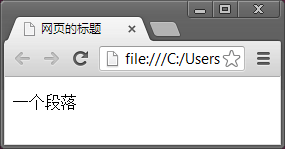

HTML 参考
====

概述
----

HTML（Hyper Text Markup Langauge，超文本标记语言）是用来描述网页信息的一门标记语言。它使用由 HTML 标签、属性及文本内容组成的 HTML 元素来描述网页的内容和语义，一系列的 HTML 元素组成 HTML 文档（通常为 .html 格式），HTML 文档在浏览器中显示为网页。

HTML 标准的最新版本为 5.0，于 [2014.10.28](http://www.w3.org/TR/html5/) 发布。  
XHTML 是使用 XML 重新定义的 HTML，最新的版本为 XHTML1.0。它与 HTML4.01 基本相同，不过在语法上更加严格：

+ 文档必须包含根元素（`<html>`）
+ 标签必须小写
+ 不允许省略属性值
+ 属性值必须使用 `""` 包括
+ 使用 `id` 代替 `name` 属性
+ 元素必须被关闭（包括成对的标签和空标签）
+ 元素必须正确嵌套

XHTML 目前已经被 HTML5 所取代。

HTML 未来的发展将逐渐脱离版本号，而发展成为一门动态发展的语言。其内容会随着时间不断丰富，并保持向前兼容的特性。

几个概念：

+ HTML 是一门标记语言，不是编程语言。
+ .html 文件称为 HTML 文档，显示在浏览器中后，才称之为网页。

HTML基础
--------

来看一个连接到 [Google](http://www.google.com/) 的超链接：

```html
<a href="http://www.google.com/">Google</a>
```

这一个超链接就是一个 `a` __元素__。其中的 `<a>` 和 `</a>` 为一对__标签__ ，`href` 为元素的__属性__，Google为元素的__内容__。

### HTML 元素

#### HTML 标签

__HTML 标签__ 指的是从 `<` 到 `>` 的一段文本，如 `<a>` `</p>` 等。

标签通常是成对存在的，如 `<h4></h4>` `<div></div>`，分别叫做 _开始标签_ 和 _结束标签_ ，结束标签在 `<` 后比开始标签多一个 `/`；  
有少部分标签不是成对的，如 `<br />` `<hr />` ，它们在 `>` 前加入 `(空格)/` 代表标签的结束（__注意：__ 要有一个空格），我们称这种不成对的标签为 _空标签_ 或 _空元素_ （HTML5 中不再要求加入 `(空格)/`，所以 `<br>` `<hr>` 也是合理的）。

成对的标签内部（`>` 和 `<` 之间）可以包含文字，也可以包含其他 HTML 标签。这种在 HTML 标签中包含其他标签的方式称为__标签嵌套__。（空标签内部是无法包含或嵌套其他内容的）

>正确的标签嵌套是使浏览器正确显示 HTML 文档内容的关键。

#### HTML 元素

__HTML 元素__ 指的是从开始标签到结束标签之间的全部内容（包括标签属性、文本和其他嵌套的标签），它是组成 HTML 文档（网页）的基本单位。

#### HTML属性

__属性__ 用来描述 HTML 元素的额外信息。如 `href` 属性用来描述 `a` 元素连接到的文件或地址（`URL`），`src` 属性用来描述 `img` 元素的图像地址。  
属性包括 _属性名_ 和 _属性值_ 两部分，中间以 `=` 连接。属性值要用 `""` 包括。

```html

```

属性要写在开始标签中，属性之间以及属性与标签文本之间要有一个空格。

### HTML 注释

HTML注释通常用来在HTML文档中添加注释文本或用来屏蔽不需要显示的代码。

```html
<!-- 注释内容 -->
```

注释由 `<!--` 和 `-->` 组成，包含在其中的任何内容都将被浏览器忽略，而不会显示在网页中（虽然其内容不会显示，但这部分代码仍然包含在 HTML 文档中，可以通过查看网页源代码来查看）。

在代码中适当地添加注释，是一个良好的习惯。它可以帮助自己和其他人理解或记录代码的相关信息，有利于将来的修改和多人协作。

### HTML 代码的编写

#### 书写规范

要编写出高质量的 HTML 代码，就需要遵守代码的书写规范。

1. HTML 代码（包括标签及属性）通常使用小写字母编写
2. 属性的值用双引号包括
3. 标签需要被关闭：成对的标签要有结束标签，空标签要有结束符（HTML5 中不再要求结束符）
4. 正确嵌套标签，遵循标签的嵌套规则
5. 根据标签的嵌套顺序，合理缩进源代码文本（通常使用两个空格来缩进）

#### 代码的编写技巧

编写代码时，有一些小技巧，可以帮助你提高效率，并减少出错：

1. 使用专业的文本编辑器或 IDE 书写代码。它们一般会提供代码的 __语法高亮__、__代码提示__ 和 __自动完成__ 等功能
2. 手写代码时，先写成对的 `<>` 、 `()` 或 `""`，再往其中添加文本。这样可以防止丢失另一半括号或引号
3. 成对的标签一次写完，如 `<a></a>`。这样可以防止丢失另一个标签

HTML标签
----

### 简单的 HTML 文档

标签是 HTML 文档的基本组成元素，我们先通过一个基本的 HTML 文档来认识一下标签的作用。

```html
<!DOCTYPE html>
  <html>
    <head>
      <title>网页的标题</title>
    </head>
  <body>
    <p>一个段落</p>
  </body>
</html>
```

我们将这段代码复制并粘贴到记事本（或其他常用的文本编辑器中，MS Word 之类的 **不可以**），并保存为 `index.html`，然后双击打开（或在浏览器中选择打开该文件），一个类似的网页会呈现出来。



上面这段代码就是一个简单而完整的 HTML 文档，我们来深入了解一下：

1. `<!DOCTYPE html>` 标签声明了该 HTML 文档的文档类型为 HTML5
2. `<html></html>` 标签是 HTML 文档的最底层标签，包含了文档的所有内容
3. `<head></head>` 代表了 HTML 文档的“头部”，这里描述了浏览器需要的一些信息，也可以定义一些需要从外部引入的文件（如 .css .js 文件）
4. `<title></title>` 定义了网页的标题，该信息会显示在浏览器的标题栏（或浏览器标签）以及收藏夹中
5. `<body></body>` 定义了网页的内容，也就是我们可以从浏览器中看到的内容

### 标签语义化

我们从上一节的例子中可以看出，每一个 HTML 标签都是有具体意义的英文单词。这种标签的 __语义化__ （Semantic），是 HTML 在制定的最初就一直遵守的规则，用来将文本等信息结构化，从而方便理解和使用。

推荐阅读：

>[HTML 标签语义化](./semantic.md "HTML Semantic")

了解了 HTML 标签的语义化之后，我们就可以开始学习每一个 HTML 标签了。

### 块级元素与内联元素

+ 块级元素（`display: block;`）的表现是占满父元素（或浏览器窗口）的整个宽度（占满一行）。可以给块级元素设置宽高等属性；
+ 内联元素（`display: inline;`）的表现是尽量收缩到内容所占的大小，一行中可以存在许多个内联元素，它们会从左向右依次排列。无法给块级元素设置宽高等属性；
+ 行内块级元素（`display: inline-block;`）拥有以上两者的特点：尽量收缩到内容所占的大小，而且可以设置宽高等属性。

嵌套规则：

+ 块级元素与行内块级元素可以包含块级元素、内联及行内块级元素；
+ 内联元素只能包含内联元素。

当然，这种限制并不是绝对的，错误的应用也并不会产生什么严重后果。比如 `<a>` 元素中经常包含其他类型的块级元素。

完整的 HTML 标签列表
----

我们根据各标签的含义及用途，进行了如下的划分：

基本标签：

>[doctype](./doctype.md "doctype 文档类型定义")  
>[html](./tag/html.md "html")  
>[head](./tag/head.md "head")  
>[body](./tag/body.md "body")

页面信息：

>[title](./tag/title.md "title")  
>[base](./tag/base.md "base")  
>[meta](./tag/meta.md "meta")  
>[style](./tag/style.md "style")  
>[script](./tag/script.md "script")

资源关联：

>[link](./tag/link.md "link")  
>[script](./tag/script.md "script")

结构相关：

>[br](./tag/br.md "br")  
>[hr](./tag/hr.md "hr")  
>[div](./tags/div.md "div") address article aside blockquote details figcaption figure footer h* header menu nav p section summary

内容相关：

>[文本族](./tags/text.md "文本族")
>：abbr bdi bdo del ins mark pre q rp rt ruby small span sub sup time  
>[超链接和锚](./tag/a.md "超链接和锚")
>：a area map  
>[多媒体](./tags/media.md "多媒体")：
>[audio](./tag/audio.md "audio")
>canvas embed img object param source track video  
>[列表](./tags/list.md "列表")：dd dl dt li ol ul   
>[表格](./tags/table.md "表格")：caption col colgroup table tbody td tfoot th thead tr  
>[表单](./tags/form.md "表单")：button command datalist fieldset form input keygen label legend meter option optgroup output progress select textarea  
>框架：iframe  
>字符实体：
>其他：b dfn code em i kbd samp strong var

其他：

HTML5 专题
---------

音视频

Canvas

WebGL

SVG

表单

控件

Drag & Drop

地理定位

数据存储

Web Worker

跨文档通信

服务器发送事件

离线应用

附录
----

### 快速开发工具

Emmet（Zen Coding）

Markdown

### 公共属性

核心属性

	id
	class
	title
	style

语言属性

	dir
	lang
	xml:lang

键盘属性

	accesskey
	tabindex

### 公共事件（事件属性）

窗口事件

表单事件

图像事件

键盘事件

鼠标事件
