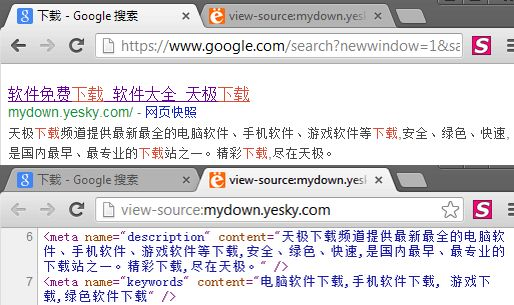

meta 标签
=========

`<meta>` 元素用来指定页面的元信息（meta-information）。比如用于搜索引擎的页面描述和关键词等信息。

属性
----

### 1.name

用于定义元信息的名称。

属性值：
>1. author 页面作者
>2. description 页面描述，用于搜索引擎搜索结果中的网站描述
>3. keywords 页面关键词，用于搜索引擎的搜索关键词
>4. generator 文档代码的生成工具描述（不常用）
>5. revised 文档代码的修订描述（不常用）

`mydown.yesky.com` 在 `Google` 中的搜索结果：
>

示例代码：

```html
<meta name="keywords" content="HTML,CSS,,JavaScript,Web" />
<meta name="description" content="Web development" />
```

### 2.http-equiv

用于定义 HTTP 头信息。

属性值：
>1. content-type 页面 MIME 信息及字符集
>2. expires 页面缓存的过期时间
>3. refresh 页面刷新或跳转
>4. set-cookie 设置 Cookie 信息

示例代码：

```html
<meta http-equiv="charset" content="text/html;charset=utf-8" /> // 建议使用 charset 属性代替
<meta http-equiv="refresh" content="10" /> // 10秒后刷新网页
<meta http-equiv="refresh" content="20;url=http://www.google.com/" /> // 20秒后跳转到google.com
```

### 3.content

用于定义元信息的内容，需要与 `name` 和 `http-equiv` 属性搭配使用。

###4.charset [HTML5]

用于定义页面的字符集。

示例代码：

```html
<meta charset="utf-8" />
```
