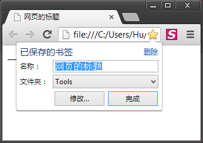
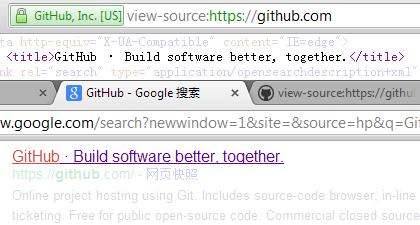

title 标签
====

`<title>` 标签用来定义 HTML 文档的标题，该信息会显示在浏览器的标题栏（或浏览器标签），收藏夹的项目名称以及搜索引擎的搜索项中。

>`简单的HTML文档` 的 `title` 属性在浏览器标签和收藏夹中的效果：  

>`GitHub.com` 的 `title` 属性在 `Google` 搜索结果中的效果：  

__提示：__

HTML文档中 __必须__ 要有 `<title>` 元素，它位于 `<head>` 元素内，而且 __只能有一个__。
