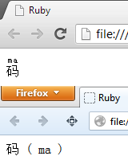

文本类标签
=========

文本类标签通常用于格式化一小段文本，它们都是内联元素。

1.abbr
------

用于定义词语的缩写形式，可以使用 `title` 属性提供完整的词语。

```html
<abbr title="Hyper Text Markup Langauge">HTML</abbr>
```

2.bdi [HTML5]
-----

unknown

3.bdo
-----

用于设置文本的方向。

```html
<bdo dir="rtl">left to right</bdo>
```

###属性

1.dir

用于设置文本的方向。

属性值：
>1. ltr [默认值] 从左向右
>2. rtl 从右向左

4.del
-----

用于定义被删除的文本，该文本会显示删除线。

###属性

1.cite

用于指定另外一个文档，该文档解释了文本被删除的原因。

属性值：
>1. url 指向解释文档

2.datetime

定义文本被删除的时间。

属性值：
>1. YYYY-MM-DDThh:mm:ssTZD 日期时间及时区

5.ins
-----

用于定义插入的文本。

###属性

与 `<del>` 元素相同。

6.mark [HTML5]
------

用于定义带有标记的文本，如搜索结果中需要高亮显示的文本。

7.pre
-----

用于定义预格式化的文本。在 `<pre>` 元素中的文本会保留空格和换行符，字体会显示为等宽字体。该元素通常用来显示源代码。

8.q
---

用于定义引用的文本，浏览器通常会在文本两端添加引号。

###属性

1.cite

用于定义引用地址。

属性值：
>1. url 引用的地址

9.rb [HTML5]
----

在 `<ruby>` 元素中使用，用于定义文字。

10.rp [HTML5]
----

在 `<ruby>` 元素中使用，用于定义不支持 ruby 元素的浏览器所显示的内容。

```html
<ruby>
  <rb>码</rb>
  <rp>(</rp>
  <rt>ma</rt>
  <rp>)</rp>
</ruby>
```

`<ruby>` 元素在浏览器中的表现：



上图分别展示了支持（Chrome 26）和不支持（Firefox 20）的效果。

11.rt [HTML5]
-----

在 `<ruby>` 元素中使用，用于定义音标文字。

12.ruby [HTML5]
-------

用于定义 ruby 注释，主要用于东亚语言的注音。

13.small
--------

用于定义旁注文字，显示为小号字体。

14.span
-------

用于分隔行内元素，常用于对文字添加样式。

15.sub
------

用于定义上标文本。

16.sup
------

用于定义下标文本。

17.time [HTML5]
-------

用于定义代表日期或时间的文本。

```html
<time datetime="2013-06-01">儿童节</time>
```

###属性

1.datetime

用于指定 `<time>` 元素中的文本代表的实际时间。

属性值：
>1. YYYY-MM-DDThh:mm:ssTZD 日期时间及时区

2.pubdate

用于指定该 `<time>` 元素的时间为内容的发布时间。

属性值：
>1. pubdate 指定时间为发布时间
